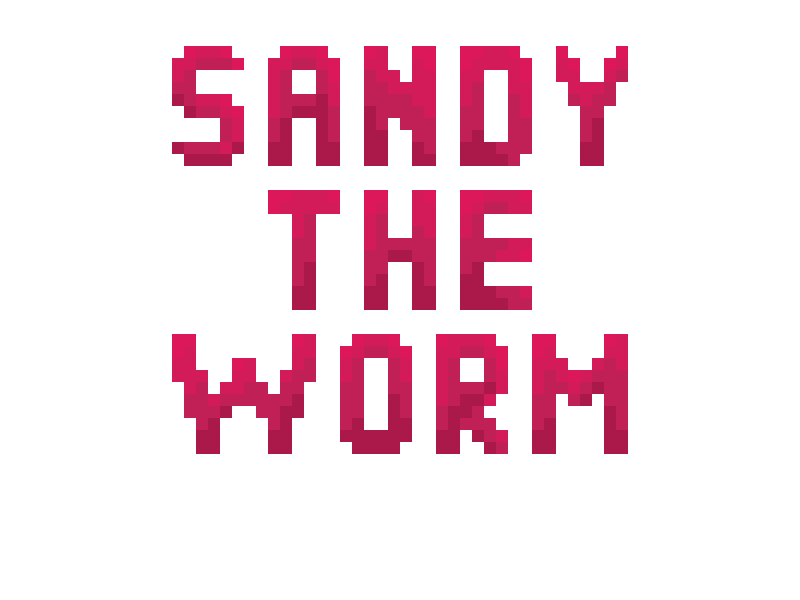
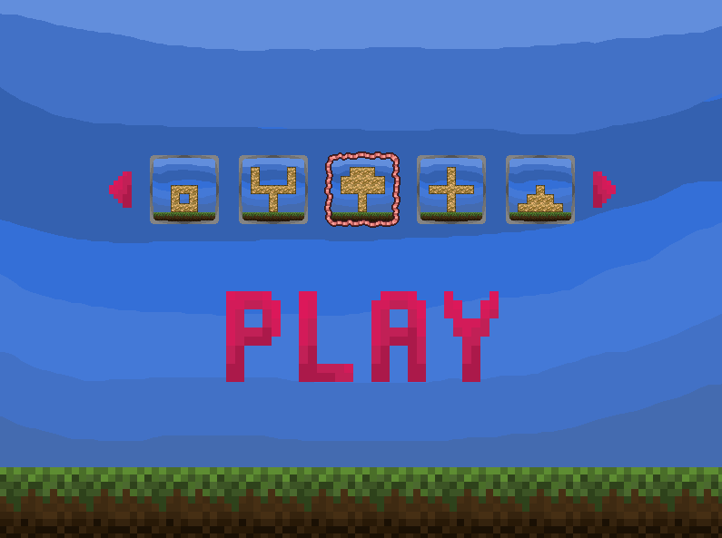
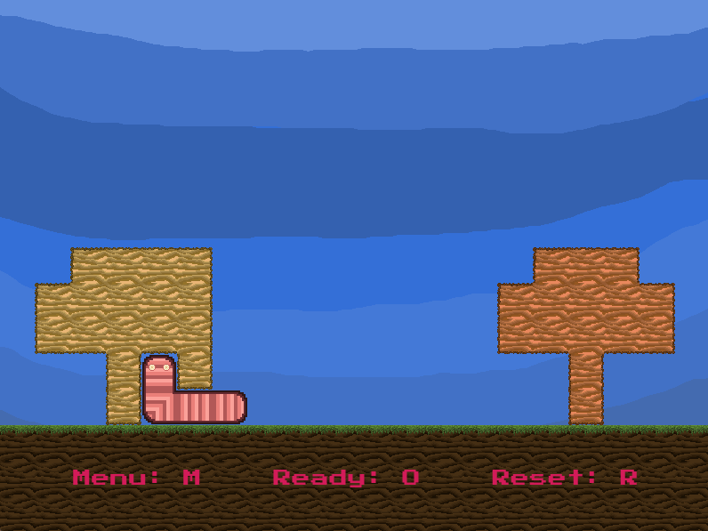

# Sandy the Worm



Sandy the Worm is a 2D C++ game built using the [SFML](https://www.sfml-dev.org/) library.

In the game you will play as a worm Sandy! His goal will be to gnaw out sand blocks of the required shape to pass the level.

The game is currently in beta testing, so there may be bugs in the game.

### Main Menu



### Gameplay



## Requirements

To build the project you will need:

- A compiler that supports C++17
- [SFML 2.6.1](https://www.sfml-dev.org/)
- [CMake 3.28.1](https://cmake.org/) or later

## Installation

**1**. Clone the repository:

```bash
git clone https://github.com/MusiJVR/Sandy-the-Worm
cd Sandy-the-Worm
```

**2**. Make sure you have the necessary dependencies installed, such as [CMake](https://cmake.org/) and [SFML](https://www.sfml-dev.org/).

**3**. Building a project with [CMake](https://cmake.org/):

```bash
mkdir build
cd build
cmake ..
cmake --build .
```

**4**. Launching the game:

Launch the `Sandy_the_Worm.exe` file or you can create a shortcut on your desktop to run the `Sandy_the_Worm.exe`.

## Issues
Please leave messages about any errors you find [here](https://github.com/MusiJVR/Sandy-the-Worm/issues) or on the [Discord](https://discord.com/channels/1222267843886841996/1222270288247525509)

## Social Media

- Page on [GitHub](https://github.com/MusiJVR/Sandy-the-Worm)
- Page on [Discord](https://discord.gg/xY8WJt7VGr)
